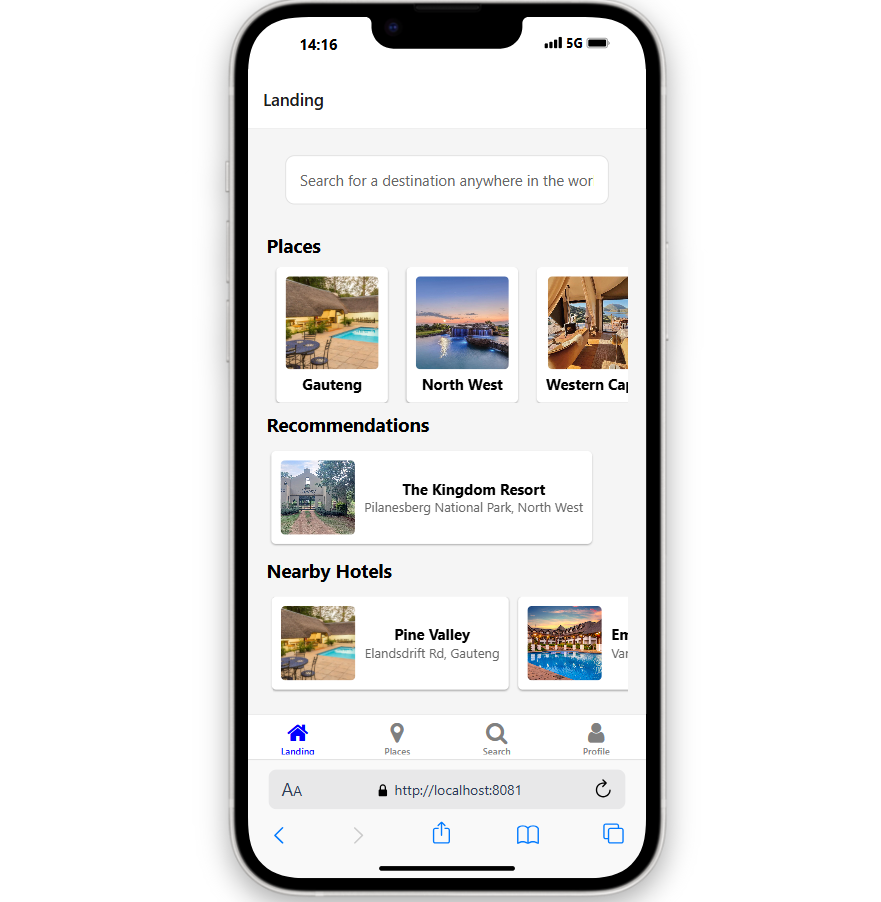
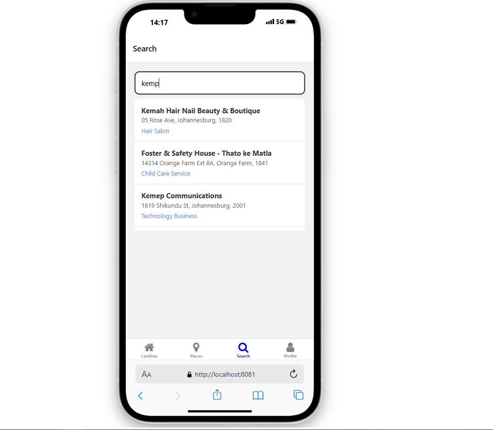
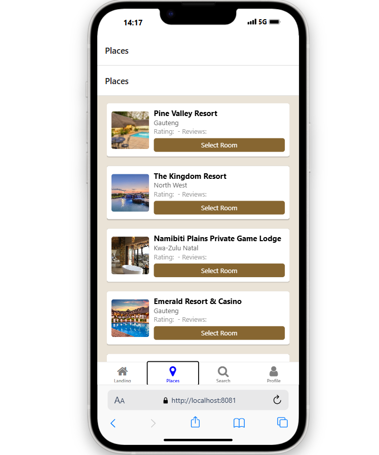

# Travel App

## Overview
The **Travel App** is a mobile application built using ***React Native*** and ***Expo***. This app allows users to find and explore resorts, hotels, and activities based on the current weather conditions at their desired location. By providing weather-based recommendations, the app helps users make the most out of their travel experiences.

## Features
- **Weather-Based Recommendations**: Get suggestions for resorts, hotels, and activities based on the current weather.
- **Interactive Map**: View locations on an interactive map to visualize proximity and directions.
- **7-Day Weather Forecast**: Access a detailed 7-day weather forecast for planning your activities.
- **Nearby Attractions**: Discover nearby attractions and points of interest.
- **User-Friendly Interface**: Enjoy a sleek, intuitive design that enhances user experience.

## Installation
To run the app locally, follow these steps:

1. **Clone the repository**:
   ```bash
   git clone https://github.com/yourusername/travel-weather-app.git
   cd travel-weather-app

1. **npm install**:
   ```bash
   npm install

1. **Start the development server:**:
   ```bash
   npx expo start


- **Usage**: 
1. Open the app: Launch the app on your mobile device using the Expo Go app or an emulator.

2. Search for a location: Use the search bar to find a destination.

3. View recommendations: Based on the current weather, view recommended resorts, hotels, and activities.

4. Explore the map: Use the interactive map to see nearby locations and get directions.

5. Check the weather: Access the 7-day weather forecast to plan your activities accordingly.


- **Technologies Used**:

- ***React Native:*** For building the mobile application.

- ***Expo:*** For developing and deploying the app.

- ***Foursquare API:*** For fetching information about resorts, hotels, and activities.

- ***OpenWeather API:*** For retrieving current weather conditions and forecasts.


- **Screenshots**:









